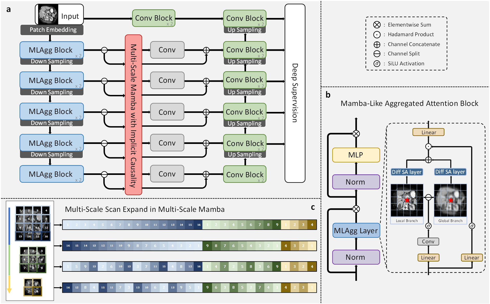

<br />
<p align="center">
  <h1 align="center">MLAgg-UNet: Advancing Medical Image Segmentation with Efficient Transformer and Mamba-Inspired Multi-Scale Sequence</h1>
  <p align="center">
    <br />
    <strong>Jiaxu Jiang</strong></a>
    ·
    <strong>Sen Lei</strong></a>
    ·
    <strong>Heng-Chao Li</strong></a>
    ·
    <strong>Yongjian Sun</strong></a>
  </p>

  <p align="center">
    <a href='https://xplorestaging.ieee.org/document/11119287'>
      
    </a>
  </p>
<br />

<div  align="center">    
 
  <em>Overview of the MLAgg-UNet architecture. MLAgg-UNet employs the encoder-decoder framework with Mamba-Like Aggregated Attention (MLAgg) blocks in the endocer, together with Multi-Scale Mamba Module (MSMM) with Implicit Causality in skip connections.</em>
</div>


## Requirements: 

Please use `Ubuntu 20.04` for environment setting. In `Windows`, it could work if mamba-ssm available. 

1. python 3.10 + [torch](https://pytorch.org/get-started/locally/) 2.0.0 + torchvision 0.15.0 (cuda 11.7)
   ```bash
   conda create -n mlaggunet python=3.10
   conda activate mlaggunet
   pip install torch==2.0.0 torchvision==0.15.1 torchaudio==2.0.1
   ```

2. Clone this repository
   ```bash
   git clone https://github.com/aticejiang/MLAgg-UNet
   cd mlagg
   pip install -e .
   ```

3. Install [monai](https://github.com/Project-MONAI/MONAI):
   ```bash
   pip install monai
   ``` 

4. Install [Mamba](https://github.com/state-spaces/mamba) :
   ```bash
   pip install causal-conv1d
   pip install mamba-ssm
   ```

## Dataset preparation

1. Data download:
   - [AbdomenMRI(U-Mamba)](https://arxiv.org/abs/2401.04722)
   - [BTCV](https://www.synapse.org/Synapse:syn3193805/wiki/89480)
   - [ACDC](https://www.creatis.insa-lyon.fr/Challenge/acdc/)
   - [Endovis17]()

2. Setting up paths:
   
   Please refer to [setting_up_paths(nnUNet)](https://github.com/MIC-DKFZ/nnUNet/blob/master/documentation/setting_up_paths.md)
   
3. Dataset conversion:
   
   Conversion via specific programs:
   e.g. ```python Dataset027_ACDC.py``` for ACDC dataset or download from ours [Baidu]()

4. Preprocessing:
   ```bash
   nnUNetv2_plan_and_preprocess -d DATASET_ID --verify_dataset_integrity
   ```

## Train models

```bash
nnUNetv2_train DATASET_ID 2d 0 -tr 
```
or using custom bath size
```bash
nnUNetv2_train DATASET_ID 2d_bsXX 0 -tr
```

## Acknowledgements

Thank the authors of [nnU-Net](https://github.com/MIC-DKFZ/nnUNet), [Mamba](https://github.com/state-spaces/mamba) and [U-mamba](https://github.com/bowang-lab/U-Mamba) for making their valuable code publicly available.

## Citation
If you find our work useful in your research, please consider citing:
```
@ARTICLE{11119287,
  author={Jiang, Jiaxu and Lei, Sen and Li, Heng–Chao and Sun, Yongjian},
  journal={IEEE Journal of Biomedical and Health Informatics}, 
  title={MLAgg-UNet: Advancing Medical Image Segmentation with Efficient Transformer and Mamba-Inspired Multi-Scale Sequence}, 
  year={2025},
  volume={},
  number={},
  pages={1-15},
  keywords={Transformers;Image segmentation;Computational modeling;Medical diagnostic imaging;Computational complexity;Feature extraction;Computer architecture;Computational efficiency;Visualization;Buildings;Medical Image Segmentation;Multi-Scale Feature Learning;Transformer;Vision State Space Models},
  doi={10.1109/JBHI.2025.3596648}}
```
